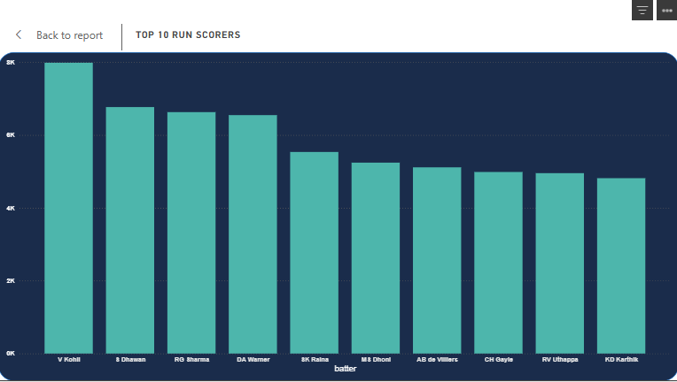
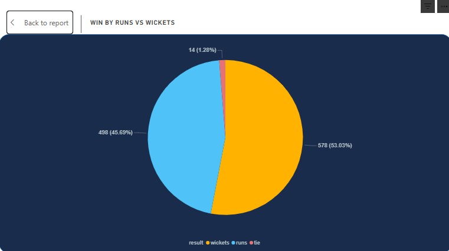

# IPL-Analytics-Dashboard

# 🏏 IPL Analytics Dashboard (2008–2023)

This project presents a comprehensive analysis of the Indian Premier League (IPL) from 2008 to 2023. Using **Python**, **Jupyter Notebook**, and **Power BI**, we explore trends, top players, and team performances through visual insights.

---

## 📌 Objectives

- Analyze ball-by-ball and match-level data from IPL
- Identify top performers: batsmen, bowlers, venues
- Study match-winning trends and toss impact
- Design an interactive, visually rich Power BI dashboard

---

## 🛠️ Tools & Technologies

- Python (Pandas, Matplotlib, Seaborn)
- Jupyter Notebook
- Power BI Desktop
- Git & GitHub

---

## 📁 Project Structure

IPL-Analytics-Dashboard/
├── data/
│ ├── matches.csv
│ └── deliveries.csv
├── notebooks/
│ └── ipl_analysis.ipynb
├── dashboard/
│ ├── IPL_Dashboard.pbix
│ └── dashboard_screenshot.png
├── visuals/
│ ├── top_batsmen.png
│ ├── toss_win_rate.png
│ ├── win_type_distribution.png
│ └── venue_performance.png
└── README.md

yaml
Copy
Edit

---

## 📊 Sample Visuals

### 🔹 Top 10 Batsmen

---

### 🔹 Toss Impact on Match Results

---

### 🔹 Win by Runs vs Wickets

---

### 🔹 Top Performing Venues

---

## 🔬 Key Insights

- MS Dhoni and Virat Kohli are among the top 5 consistent run scorers.
- Toss winners won the match **~52% of the time**, showing marginal advantage.
- Chinnaswamy and Wankhede Stadiums are high-scoring grounds.
- Teams chase better under lights in most stadiums.

---

## ▶️ How to Use

### 1. Run Python Analysis

- Open `ipl_analysis.ipynb` in Jupyter Notebook
- Ensure `matches.csv` and `deliveries.csv` are in the `data/` folder
- Run the notebook to explore and generate visuals

### 2. Explore Power BI Dashboard

- Open `IPL_Dashboard.pbix` in Power BI Desktop
- Interact with visuals and filters

---

## 📦 Dataset Source

Sourced from Kaggle:  
[IPL Complete Dataset (2008–2020)](https://www.kaggle.com/datasets/patrickb1912/ipl-complete-dataset-20082020)

Manually extended to cover seasons up to 2023.

---

## 👨‍💻 Author

**Rudra Save**  
📫 [Connect on LinkedIn](https://www.linkedin.com)  
📁 [Visit My GitHub Portfolio](https://github.com/)

---

## ⭐ Show Some Love

If you like this project, please ⭐ the repo and share your feedback!
