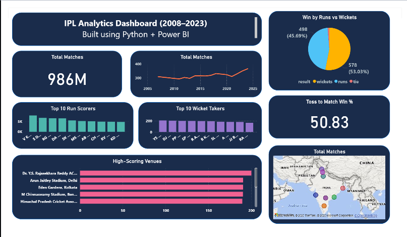
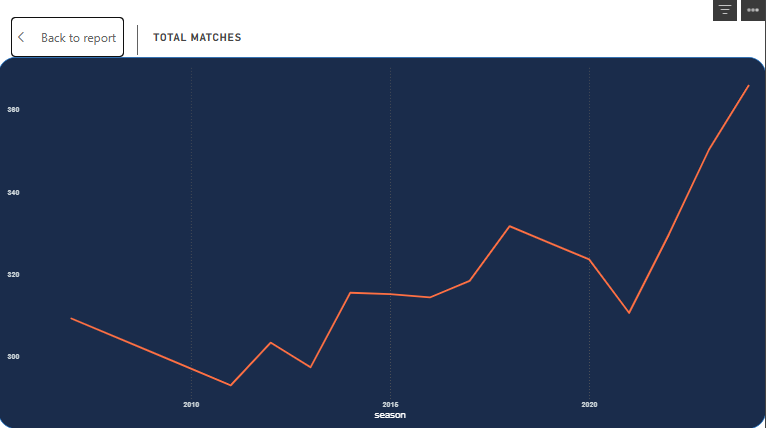
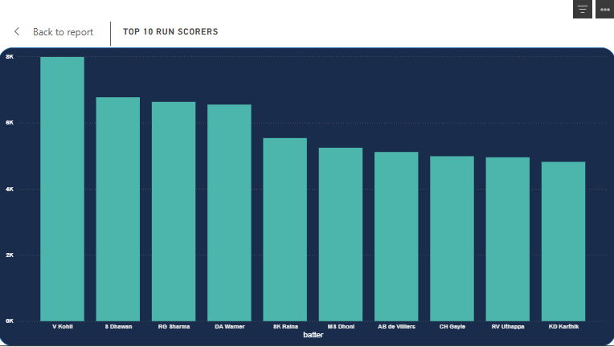
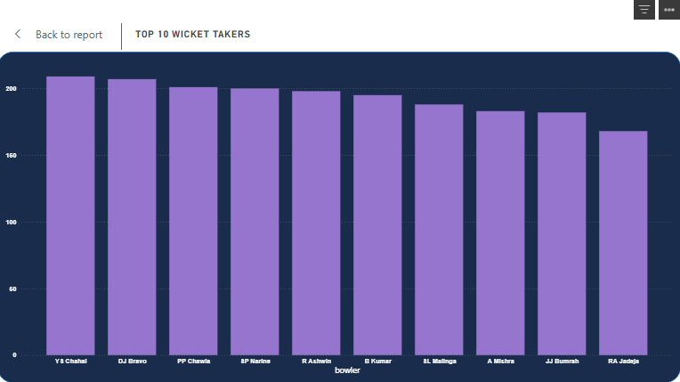
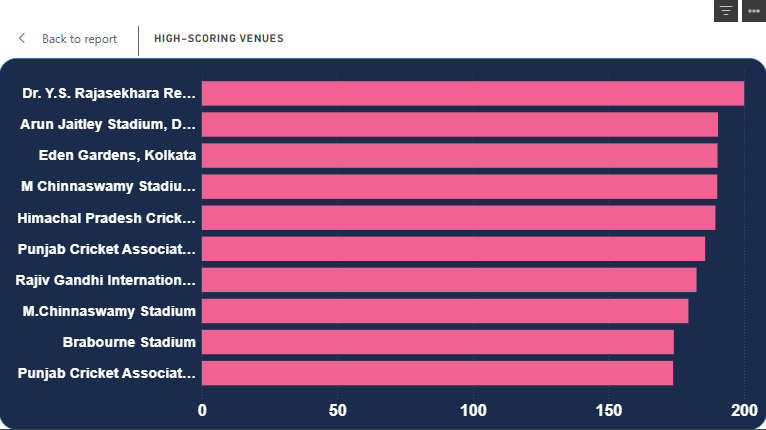
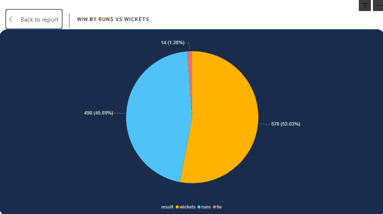

<!-- # 🏏IPL Analytics Dashboard (2008–2023)

A data-driven exploration of the Indian Premier League using Python (Pandas, Matplotlib), Jupyter Notebook, and Power BI. Insights include top performers, venue trends, toss impact, and win types—delivered via an interactive dashboard.


##  Table of Contents
- [Introduction](#-ipl-analytics-dashboard-20082023)
- [Badges](#badges)
- [Demo](#demo)
- [Features](#features)
- [Project Structure](#project-structure)
- [Usage / Examples](#usage--examples)
- [Installation](#installation)
- [Run Locally](#run-locally)
- [Dataset Source](#dataset-source)
- [Key Insights](#key-insights)
- [Documentation](#documentation)
- [Running Tests](#running-tests)
- [Roadmap](#roadmap)
- [Optimizations](#optimizations)
- [Contributing](#contributing)
- [FAQ](#faq)
- [Acknowledgements](#acknowledgements)
- [Authors](#authors)
- [Feedback](#feedback)


## Badges

- Tech Stack 
    
    
    

- License + Contributions 
    [](https://choosealicense.com/licenses/mit/)
    

 - GitHub Repo Stats
    
    
    


## Demo

- **Dashboard** (Power BI): `dashboard/IPL_Dashboard.pbix`  
- **Screenshot:** `dashboard/dashboard_screenshot.png`  


## Features

- Analyze **ball-by-ball** and **match-level** data (2008–2023)  
- Identify **top batsmen & bowlers**  
- **Venue trends** (high-scoring grounds, chasing vs. defending)  
- **Toss impact** and **win-type distributions**  
- Reproducible **Python notebook** + **Power BI** dashboard  


## Project Structure
```plaintext
IPL-Analytics-Dashboard/
├── data/
│   ├── matches.csv
│   └── deliveries.csv
├── notebooks/
│   └── ipl_analysis.ipynb
├── dashboard/
│   ├── IPL_Dashboard.pbix
│   └── dashboard_screenshot.png
├── visuals/
│   ├── top_batsmen.png
│   ├── toss_win_rate.png
│   ├── win_type_distribution.png
│   └── venue_performance.png
└── README.md

```

## Usage/Examples

- Run Python Analysis
``` 
Open `notebooks/ipl_analysis.ipynb` in Jupyter.
```

- Ensure these cleaned CSVs are in `data/`:
```
   - cleaned_matches.csv  
   - top_batsmen.csv  
   - top_bowlers.csv  
   - toss_analysis.csv  
   - venue_avg_scores.csv  
   - avg_score_season.csv 
   ```

- Run cells
``` 
Run cells to **explore, transform, and export visuals** to `/visuals`.
```
- Explore Power BI Dashboard
```
1. Open `dashboard/IPL_Dashboard.pbix` in Power BI Desktop.  
2. Interact with **filters**, **slicers**, and **pages** to explore players, teams, and seasons.
```


## Installation
- Clone
```
git clone https://github.com/<your-username>/

IPL-Analytics-Dashboard.git

cd IPL-Analytics-Dashboard 
```

-  Create venv

```
# Windows: .venv\Scripts\activate
# macOS/Linux: source .venv/bin/activate

```

- Install Python dependencies
```
pip install -r requirements.txt

```
## Run Locally

Clone the project

```bash
  jupyter notebook notebooks/ipl_analysis.ipynb
```


## Dataset Source

- Base dataset: **Kaggle – IPL Complete Dataset (2008–2020)**  
- Extended manually to cover seasons up to **2023**  

➡️ Place raw CSVs in `data/`. Cleaned outputs are generated by the notebook.

## Key Insights

- **MS Dhoni** and **Virat Kohli** remain among the top 5 consistent run scorers.  
- **Toss winners** won ~52% of matches → marginal advantage.  
- **Chinnaswamy** and **Wankhede** are high-scoring venues.  
- **Chasing** under lights performs better at many grounds.  

## Documentation

- [Notebook Walkthrough](Notebooks/ipl(08-24)-checkpoint.ipynb)  
- [Visual Exports](visuals/)  
- [Dashboard File](dashboard/)  


## Running Tests

To run tests, run the following command

```bash
  npm run test
```

To run tests, run the following command:

```bash
python tests/schema_check.py
```


---

And then in your repo, just create a simple file `tests/schema_check.py` with this content (so the command actually works):

```python
import pandas as pd

matches = pd.read_csv('data/matches.csv')
deliveries = pd.read_csv('data/deliveries.csv')

assert {'id','season','team1','team2'}.issubset(matches.columns)
assert {'match_id','over','ball','batsman','bowler'}.issubset(deliveries.columns)

print("✅ Basic schema OK")
```
## Roadmap


- [ ] Add **player form** and **rolling averages**  
- [ ] Integrate **fielding metrics**  
- [ ] Publish as a **Streamlit** mini-app  
- [ ] Power BI theme + DAX optimization  
- [ ] Automate **data updates** for new seasons  

## Optimizations

- Cached intermediate CSVs for faster reloads  
- Pre-aggregations for Power BI (season, venue, player)  
- Consistent **date/season normalization**  
- Clean **DAX measures** for stable visuals  

## Contributing

Contributions are always welcome!

    1. Fork the repo  
    2. Create a feature branch  
    3. Open a PR with a clear description + screenshots (if UI)  

## FAQ

#### 1. Which seasons are covered?

A: 2008–2023 (base Kaggle 2008–2020 + manual extension).  

#### 2. Do I need Power BI Pro?

A: No for local Desktop. Pro only if you publish/share on the Power BI Service. 

#### 3.  Can I use only Python outputs?

A: Yes—use the notebook and visuals in `/visuals`.

.  


## Acknowledgements


- [Kaggle IPL Dataset (2008–2020)](https://www.kaggle.com/datasets/nowke9/ipldata) – base dataset  
- [Pandas Documentation](https://pandas.pydata.org/docs/) – data analysis  
- [Matplotlib Documentation](https://matplotlib.org/stable/users/index.html) – visualization  
- [Power BI Community](https://community.powerbi.com/) – dashboard best practices  

## Authors

- [Github](https://github.com/rudrasave)  
- [LinkedIn](https://www.linkedin.com/in/rudra-save-a90749358/)  

## Feedback

💡 Have ideas or spot issues? Open a GitHub **Issue** or start a **Discussion**.  
⭐ If this project helped you, please star the repo!  -->

# 🏏 IPL Performance Analytics Dashboard


An interactive **Business Intelligence dashboard** built using **Power BI, DAX, Power Query, and Python** to analyze historical Indian Premier League (IPL) data from **2008–2023**. The project transforms raw cricket datasets into meaningful business insights through KPI reporting, interactive visualizations, and trend analysis.

---

# 📌 Overview

The IPL Performance Analytics Dashboard demonstrates the complete Business Intelligence lifecycle—from data collection and transformation to dashboard development and insight generation.

Using historical IPL match and ball-by-ball datasets, the dashboard enables users to analyze player performance, venue statistics, season trends, match outcomes, and toss impact through interactive reports.

This project showcases practical skills in:

- Business Intelligence
- Dashboard Development
- Data Cleaning
- Data Modeling
- DAX Calculations
- KPI Reporting
- Data Visualization

---

# 🎯 Business Problem

IPL generates thousands of match records every season, making it difficult to manually identify player performance trends, venue statistics, and winning patterns.

Traditional spreadsheets cannot efficiently answer questions such as:

- Who are the highest run scorers?
- Which bowlers consistently perform well?
- Which venues produce the highest scores?
- Does winning the toss significantly influence match outcomes?
- How has the IPL evolved over multiple seasons?

The objective of this project is to convert raw cricket datasets into an interactive Business Intelligence dashboard that enables quick, data-driven decision making.

---

# 💡 Solution

The dashboard provides a centralized analytical platform that allows users to:

- Analyze batting performance across IPL seasons
- Evaluate bowling statistics
- Compare venue performance
- Track season-wise growth
- Measure toss impact on winning probability
- Visualize match outcome distributions
- Explore interactive KPIs using Power BI

---

# 📊 Dashboard Preview



---

# 📈 Key Performance Indicators (KPIs)

The dashboard provides interactive KPIs including:

- 🏏 Total IPL Matches
- 📅 Season-wise Match Trends
- 👤 Top Run Scorers
- 🎯 Top Wicket Takers
- 🏟 High Scoring Venues
- 🪙 Toss Win Percentage
- 📊 Match Result Distribution
- 📈 Historical Performance Trends

---

# 💡 Key Business Insights

Analysis of IPL data revealed several meaningful insights:

- Virat Kohli remains the highest run scorer across IPL history.
- Winning the toss provides only a marginal advantage (~51%), indicating team performance has greater influence on match outcomes.
- Bengaluru and Mumbai consistently host high-scoring matches.
- Teams chasing targets have historically won slightly more matches than teams defending totals.
- IPL has experienced steady expansion, reflected by the increasing number of matches each season.

---

# 🏗 Business Intelligence Workflow


The dashboard follows a standard Business Intelligence workflow:


Historical IPL Dataset
↓
Power Query
↓
Data Cleaning
↓
Data Modeling
↓
DAX Measures
↓
Power BI Dashboard
↓
Business Insights


---

# 📊 Dashboard Features

## 📈 Season Trend Analysis



Visualizes the number of IPL matches conducted each season, highlighting tournament growth over time.

---

## 👤 Top Run Scorers



Ranks the highest run-scoring batsmen across all IPL seasons.

---

## 🎯 Top Wicket Takers



Compares leading bowlers based on total wickets taken.

---

## 🏟 High Scoring Venues



Highlights venues that consistently produce high-scoring matches.

---

## 🪙 Toss Impact Analysis


Analyzes whether winning the toss significantly influences match outcomes.

---

## 📊 Match Result Distribution



Displays the proportion of matches won by runs versus wickets.

---

# 💻 Technology Stack

| Category | Technologies |
|-----------|--------------|
| Dashboard | Power BI |
| Data Transformation | Power Query |
| Calculations | DAX |
| Programming | Python |
| Data Analysis | Pandas |
| Development | Jupyter Notebook |
| Dataset | IPL Historical Dataset (2008–2023) |

---

# 📁 Repository Structure


IPL-Analytics-Dashboard/

├── data/
│ ├── matches.csv
│ └── deliveries.csv
│
├── notebooks/
│ └── IPL_Analytics.ipynb
│
├── visuals/
│ ├── dashboard-overview.png
│ ├── season-trend.png
│ ├── top-run-scorers.png
│ ├── top-wicket-takers.png
│ ├── high-scoring-venues.png
│ ├── toss-impact-analysis.png
│ ├── match-result-distribution.png
│ └── architecture.png
│
├── IPL Analytics Dashboard.pbix
├── README.md
├── requirements.txt
└── LICENSE


---

# 🚀 Getting Started

## Prerequisites

- Power BI Desktop
- Python 3.10+
- Jupyter Notebook

Install required libraries:

```bash
pip install pandas matplotlib jupyter
Running the Project
Clone Repository
git clone https://github.com/rudrasave/IPL-Analytics-Dashboard.git

cd IPL-Analytics-Dashboard
Open Notebook
jupyter notebook notebooks/IPL_Analytics.ipynb
Open Dashboard

Open

IPL Analytics Dashboard.pbix

using Microsoft Power BI Desktop.

📈 Business Impact

This dashboard demonstrates practical Business Intelligence capabilities including:

KPI Development
Interactive Dashboard Design
Data Cleaning & Transformation
DAX-Based Analytics
Sports Performance Analysis
Executive Reporting
Data-Driven Decision Making
🔮 Future Enhancements
Player performance prediction using Machine Learning
Live IPL data integration
Advanced DAX measures
Drill-through reports
Mobile dashboard optimization
Automated data refresh
📜 License

This project is licensed under the MIT License.

👨‍💻 Author

Rudra Save

📧 rudrasave1709@gmail.com

🔗 LinkedIn: https://www.linkedin.com/in/rudra-save-a90749358/

💻 GitHub: https://github.com/rudrasave
